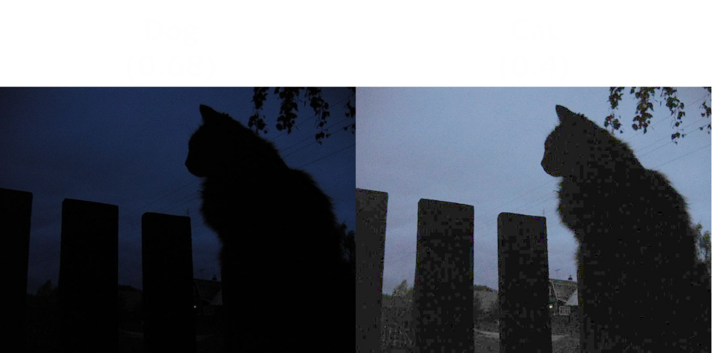
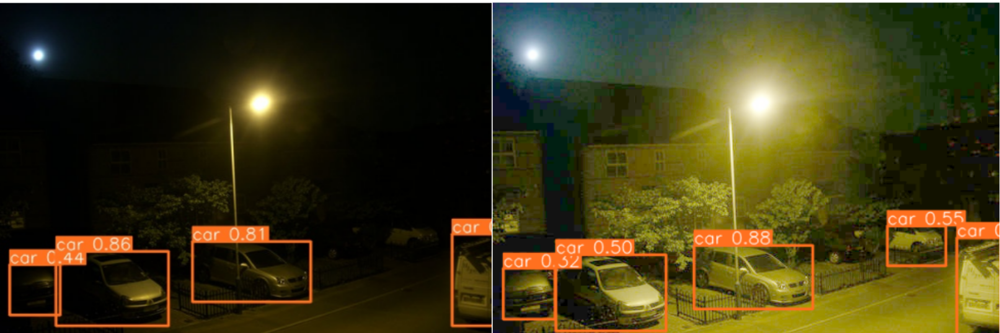

# CS231_Low-light Enhancement in Binary Image Classification
The low light enhancement for the Binary Image Classification Tasks project







# I. Low-light enhancement techniques


# II. Guide

## Struture


## Dataset 

- Dowload the Exdark dataset (including images and annotations) in https://github.com/cs-chan/Exclusively-Dark-Image-Dataset.

- At ```dataset.py```, replace in ExDark_pytorch.__init__ the *anno_dir* and *img_dir* variables corresponding to your local path.

    ```python
        class ExDark_pytorch(Dataset):
            def __init__(self, annotations_file, 
                        transform, 
                        enhance_type=None,
                        anno_dir=, "path_to_folder_of_images"
                        img_dir="path_to_folder of annator"): # 
                
                with open(annotations_file, "r") as f:
                    lines = f.readlines()
                    lines = [line.strip() for line in lines]
                    ....
    ```
## Training and Testing

- Run following cmd to training and testing the *image classification*, the more detailed is in flag descriptions of ```train.py``` and ```test.py```.

    ```cmd
    python train.py --train_model classification --pretrained Trained_model/best_classify_NN.pth --train_annotator Splits/Train.txt --test_annotator Splits/Test.txt --enhanced_type log_transform
    ```

    ```cmd
    python test.py --test_model classification --pretrained Trained_model/best_classify_NN.pth --test_annotator Splits/Test.txt --enhanced_type log_transform 
    ```


# Requiremnts
```txt
pytorch cudn
tensorflow cudn
```

